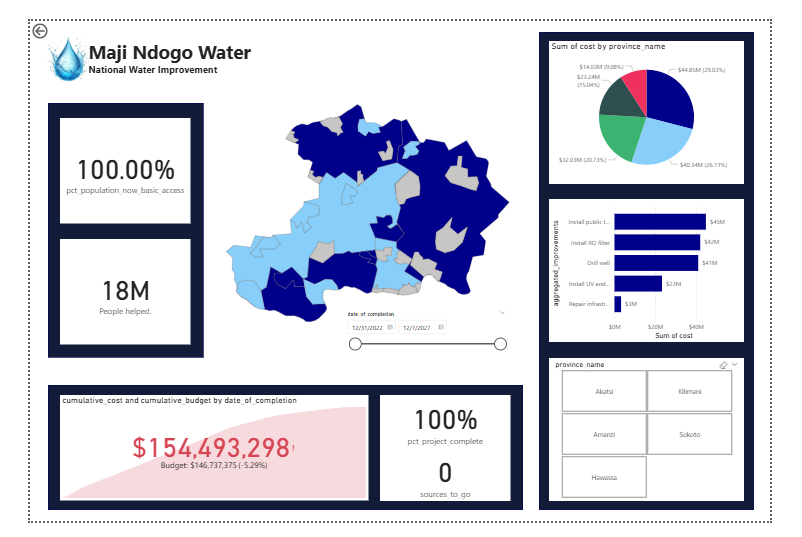
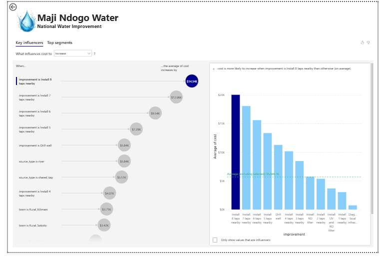
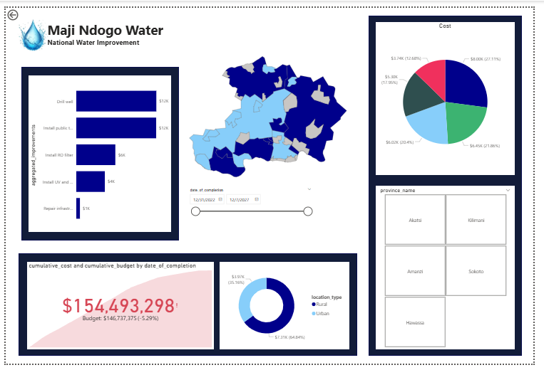
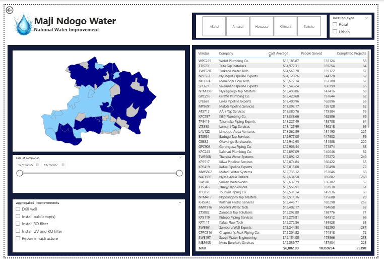

# Maji Ndogo Water Project
Power BI Dashboard | ALX Data Analytics

## Project Overview
The Maji Ndogo Water Project is a Power BI analytics project completed during my ALX Data Analytics training. The project focuses on analyzing water access improvement initiatives across the fictional country of Maji Ndogo.

Although fictional, the dataset reflects real-world challenges around clean water access, infrastructure development, cost management, and impact measurement. The goal of this project was to transform raw project data into interactive dashboards that support decision-making, transparency, and accountability.

## Problem Context
Water access projects often involve multiple stakeholders, vendors, regions, and types of improvements. Without clear analysis, it becomes difficult to answer questions such as:
- Where is money being spent?
- Which improvements are most expensive?
- How many people are being served?
- Which regions or vendors require closer monitoring?
- What factors drive project cost increases?

This project addresses those questions through structured analysis and visualization.

## Tools Used
- Power BI Desktop – data modeling, DAX measures, interactive dashboards
- Excel – source dataset and data preparation

## Dashboards Built
This project consists of four dashboards, each designed for a specific analytical purpose.

1. Public Dashboard
This dashboard provides a high-level overview suitable for public reporting and stakeholder communication.

Key elements:
- Percentage of population with basic water access
- Total number of people helped
- Regional map showing project distribution
- Total cost vs allocated budget
- Overall project completion status

Purpose:
- To quickly communicate impact, coverage, and progress.

2. Effect Dashboard
This dashboard focuses on cost and impact analysis.

Key elements:
- Cost breakdown by improvement type (drilling, public taps, filters, repairs, etc.)
- Cost distribution by province
- Urban vs rural investment comparison
- Time-based analysis using project completion dates
- Interactive province and improvement slicers

Purpose:
- To understand where resources are going and how effective investments are.

3. Key Influencer Dashboard
This dashboard utilizes Power BI’s Key Influencers visual to illustrate the factors driving cost increases.

Key elements:
- Factors that influence higher project costs
- Comparison of average costs across improvement types
- Insights into how location, improvement type, and source affect spending

Purpose:
- To move beyond “what happened” and answer why costs increase.

4. Vendor Performance Dashboard
This dashboard evaluates vendor contribution and performance.

Key elements:
- Vendor and company details
- Average project cost per vendor
- Number of people served
- Completed projects count
- Date of completion slicer
- Improvement type slicer

Purpose:
- To assess vendor efficiency, scale, and delivery performance.

## Key Questions Answered
- How are water improvement costs distributed across regions?
- Which improvement types are most expensive?
- What factors drive project cost increases?
- How does investment differ between urban and rural areas?
- Which vendors deliver the highest impact?
- How many people are being served by completed projects?

## Key Insights
- Investment and project costs vary significantly by region and improvement type.
- Certain improvements (such as drilling and large infrastructure installations) are the main cost drivers.
- Urban projects generally attract higher spending than rural ones.
- Key influencer analysis highlights specific conditions that consistently increase costs.
- Vendor performance analysis reveals differences in scale, efficiency, and impact.

## What This Project Demonstrates
- Data modeling and analysis in Power BI
- Use of DAX to calculate KPIs and metrics
- Analytical thinking beyond visualization
- Cost, impact, and performance evaluation
- Clear data storytelling for decision support

## Notes
This project was completed as part of my ALX Data Analytics learning journey and reflects my approach to solving real-world problems using data visualization and analysis.

## Preview

